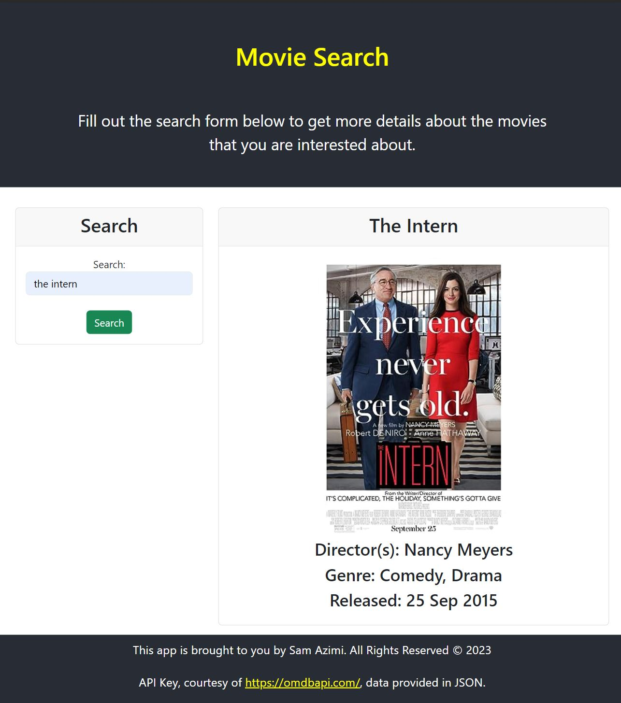

# Movie Info API Fetch

This React app allows the user to serach a movie by name via the GUI search field and reterieve general information about that move. 
The app uses OMDB API to fetch and retreave selected information about the movies. For more information about the API you can visit the [OMBD API Website](https://omdbapi.com/).

## My Approach

I intend to use `hooks` and `props` in order to keep my code clean and DRY. I will use `bootstrap mini` to keep the packet sizes small. As for the API I will use `axios`, and will keep the code under a separate `util` folder. 

Here is what I envision the overall folder structure to look like. This may cahnge after I have fully developed the app and in case I want to tweek it to make it more responsive.:

```
src/
|-- index.jsx               # Entry point for my React app
|-- App.jsx                 # Main componenet to assemble the app
|-- App.css                 # Overall style of the app
|-- components/             # React components live here
|   |-- Header              # Header component
|   |-- Footer              # Footer component
|   |-- GuiContainer.jsx    # General Container for all GUI functions
|   |-- SearchForm.jsx      # User form to collect user input
|   |-- Card.jsx            # General display placeholder
|   |-- MovieInfo.jsx       # Details will be renders here
|   |-- Row.jsx             # To implement bootstrap layout
|   |-- Column.jsx          # To implement bootstrap layout
|   |-- Container.hsx       # Overall container to style the body
|-- utils/
|   |-- Api.js

```
## What It Lookes Like

Here is the overall look and feel of the app:



## What I Used

For this app, I used `React` on the front end. It helped me to put it together quickly by leveraging `create-react-app`. 
I find it very powrefull specially when I have to create Graphi User Interfaces. The `Form` components are specially usefull to achieve this.
For the styling of the page, I used a mixture of `Bootstrap` for laying out the page and formatting the user interface, as well as `CSS in JSX` for the overall theme, font, and responsiveness of the app.

As for fetching the data I used `Axios`, which is a convenient JavaScript library for making HTTP requests from a web browser or a Node. js server, and its versitility makes it a good companion to React. 

Additionally I used a third party API provided by [OMBD API Website](https://omdbapi.com/) because it is free and served my purpose of putting together this quick app. My gratitude goes to the guys who have put it together and keep it maintained. Thanks everyone!

## Deployment

You can see the deployed app on `GitHub Pages` by simply going the link below:
[Movie Info - Where you can do a quick search for details of your favourite movies](https://dinozio-design.github.io/movie-info-api).

You can also see the public repository for this app on `GitHub` by following this link:
[movie-info-api GitHub repository by Sam](https://github.com/dinozio-design/movie-info-api).

### End Note
I hope you enjoy this app.<br/>
Cheers <br/>
Sam <br/>
2023-11-30
